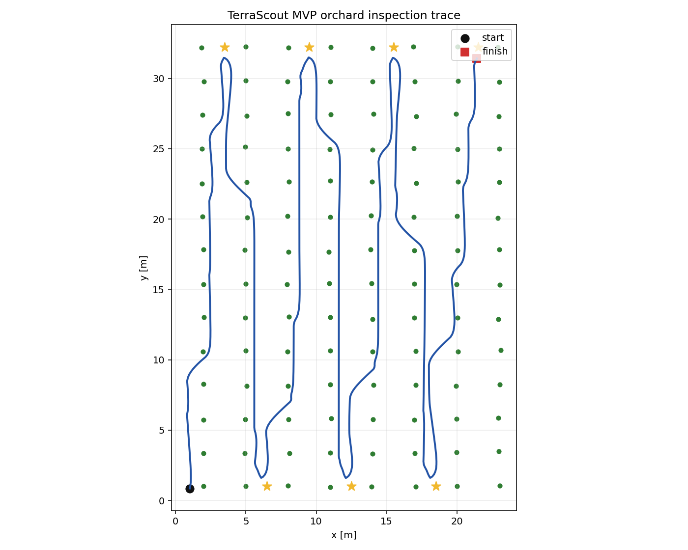

# TerraScout

TerraScout is a compact autonomy demo for a simulated crop-inspection rover in a GPS-degraded orchard. It was scoped for a short creator-challenge build: make the rover actually move, inspect rows, avoid obvious hazards, emit metrics, and leave a clean path for deeper robotics modules later.



## What Works Today

- Procedural orchard generation with tree landmarks and moving field workers.
- Differential-drive rover dynamics with wheel-speed saturation and slip.
- Twin-loop PID waypoint tracking.
- Lidar-style noisy cluster detections for trees and workers.
- Constant-velocity Kalman tracking for moving worker detections.
- Grid A* path planning over inflated tree and worker obstacles.
- End-to-end row-inspection mission runner with deterministic metrics.
- Benchmark CSV generation, unit tests, and GitHub Actions CI.

This is intentionally **TerraScout MVP**, not a finished research-grade autonomy stack. The current mission runner uses ground-truth pose and a grid planner; localization, SLAM, and Hybrid A* are on the roadmap.

## Quick Start

```bash
python -m venv .venv
source .venv/bin/activate
python -m pip install --upgrade pip
python -m pip install -e ".[dev]"
python -m terrascout.runner.mission --seed 7 --trace artifacts/mission_trace.json
python -m terrascout.viz.render --trace artifacts/mission_trace.json --out artifacts/mission_trace.png
python benchmarks/run_benchmark.py
python -m pytest
```

If `pytest` is not installed, the tests also run with the standard library:

```bash
python -m unittest discover -s tests
```

## Current Benchmark

Run on a local laptop with the default MVP configuration: 8 tree rows, 7 inspection lanes, 14 trees per row, and one moving worker.

| Seeds | Mean inspection success | Collision events | Mean wall time |
| --- | ---: | ---: | ---: |
| 2, 3, 5, 7, 11 | 100% | 0 | ~0.34 s |

Benchmark output is written to `artifacts/benchmark.csv`.

## Architecture

```text
terrascout/
  sim/        orchard world, rover kinematics, sensor detections
  control/    PID drive controller
  tracking/   Kalman worker tracker
  plan/       grid A* planner
  runner/     end-to-end mission loop
  viz/        mission trace renderer
```

Runtime flow:

1. The world emits noisy lidar-style detections.
2. The Kalman tracker updates worker tracks and predicts near-future positions.
3. The planner builds an inflated occupancy grid from trees and predicted workers.
4. The PID controller tracks the next waypoint.
5. The mission runner records row-inspection, collision, path-length, and timing metrics.

## Roadmap

- Replace ground-truth pose with Monte-Carlo localization against the orchard map.
- Add tree-trunk landmark extraction and EKF-SLAM.
- Replace grid A* with Hybrid A* over `(x, y, theta)`.
- Add a row scheduler based on battery/time/priority state.
- Generate animated GIFs for challenge/demo submissions.
- Expand tests into coverage-gated CI.

## Why This Exists

The goal is to show an end-to-end autonomy slice that is small enough to understand but complete enough to run: a simulated rover, sensors, tracking, planning, control, evaluation, and a reproducible public repo.
