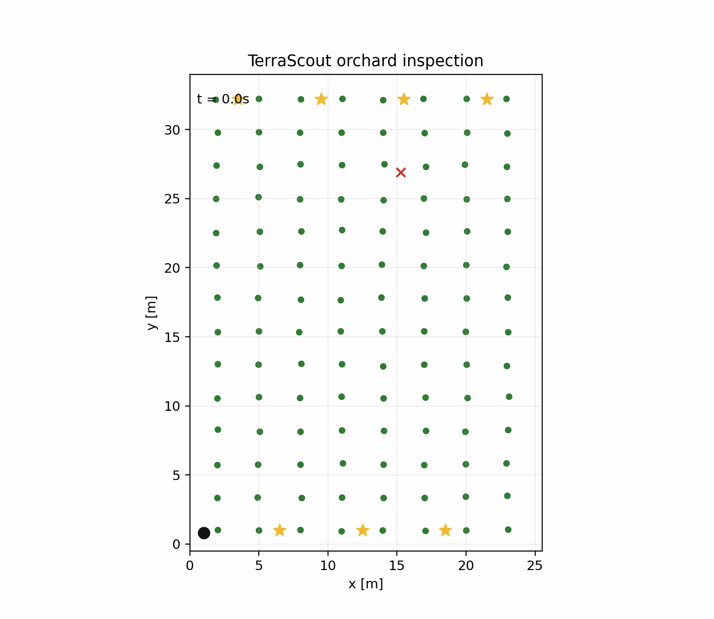

# TerraScout

TerraScout is a compact autonomy demo for a simulated crop-inspection rover in a GPS-degraded orchard. It was scoped for a short creator-challenge build: make the rover actually move, inspect rows, avoid obvious hazards, emit metrics, and leave a clean path for deeper robotics modules later.



## What Works Today

- Procedural orchard generation with tree landmarks and moving field workers.
- Differential-drive rover dynamics with wheel-speed saturation and slip.
- Twin-loop PID waypoint tracking.
- Lidar-style noisy cluster detections plus 270-degree / 0.5-degree scan frames.
- IMU yaw-rate and wheel-encoder tick samples for the simulator sensor frame.
- Constant-velocity Kalman tracking for moving worker detections.
- KLD-adaptive particle-filter localization with coarse-to-fine lidar scan matching from a +/-5 m, +/-30 degree pose prior.
- Online Gaussian tree-landmark mapping from local range/bearing detections.
- Compact EKF-SLAM back end with state expansion, covariance propagation, and range/bearing updates.
- Grid A* path planning over inflated tree and worker obstacles.
- Hybrid A* planning over a coarse `(x, y, theta)` lattice with forward/reverse arc primitives and an analytic bounded-curvature connector.
- Resource-aware inspection scheduler over row priority, travel cost, battery, and daylight budgets.
- Battery state-of-charge model with recharge-station contact telemetry.
- Runtime safety supervisor that scales wheel commands near perceived or predicted workers.
- End-to-end row-inspection mission runner with deterministic metrics.
- Static PNG and animated GIF rendering for mission traces.
- Benchmark CSV generation, unit tests, and GitHub Actions CI.

This is a simulation-first autonomy stack, not a finished field robot. The default mission uses ground-truth pose for the most stable demo path, but estimated-pose control is available with `--pose-source particle` or `--pose-source slam`. Hybrid A* is available with `--planner hybrid`.

## Quick Start

```bash
python -m venv .venv
source .venv/bin/activate
python -m pip install --upgrade pip
python -m pip install -e ".[dev]"
python -m terrascout.runner.reproduce --skip-gif
```

That one command writes the demo trace, PNG, metrics CSVs, benchmark CSVs, stress-test outputs, and `artifacts/reproduce_summary.json`. To also regenerate the animated GIF, omit `--skip-gif`.

Useful individual commands:

```bash
python -m terrascout.runner.mission --seed 7 --trace artifacts/mission_trace.json
python -m terrascout.runner.mission --scenario scenarios/default_orchard.json --trace artifacts/scenario_trace.json
python -m terrascout.runner.mission --seed 7 --planner hybrid --trace artifacts/hybrid_trace.json
python -m terrascout.runner.mission --seed 7 --pose-source particle --trace artifacts/particle_trace.json
python -m terrascout.runner.mission --rows 30 --max-goals 10 --battery-budget-m 700 --daylight-budget-s 900 --trace artifacts/large_trace.json
python -m terrascout.viz.render --trace artifacts/mission_trace.json --out artifacts/mission_trace.png --gif artifacts/mission_trace.gif
python benchmarks/run_benchmark.py
python benchmarks/control_benchmark.py
python benchmarks/tracking_benchmark.py
python benchmarks/localization_benchmark.py
python benchmarks/scheduler_benchmark.py
python benchmarks/resource_scheduler_benchmark.py
python benchmarks/planner_benchmark.py
python benchmarks/slam_benchmark.py
python benchmarks/end_to_end_benchmark.py
python benchmarks/stress_benchmark.py
python docs/design/render_design_pdfs.py
python -m pytest
```

If `pytest` is not installed, the tests also run with the standard library:

```bash
python -m unittest discover -s tests
```

## Current Benchmark

Run on a local laptop with the default configuration: 8 tree rows, 7 inspection lanes, 14 trees per row, and one moving worker.

| Seeds | Pose source | Mean inspection success | Collision events | Mean localization error | Final SOC | Mean wall time |
| --- | --- | ---: | ---: | ---: | ---: | ---: |
| 2, 3, 5, 7, 11 | truth | 100% | 0 | ~0.19 m | ~90% | ~3.2 s |
| 20-seed 30-row acceptance | truth | 100% | 0 | 0.199 m | n/a | 10.8 s |

Benchmark output is written to `artifacts/benchmark.csv`.

L0 control benchmark output is written to `artifacts/control_benchmark.csv`. It evaluates 10 randomized slip/friction runs for straight-line cross-track error, 90-degree heading-settle time, and heading overshoot.

L1 tracking benchmark output is written to `artifacts/tracking_benchmark.csv`. The benchmark evaluates 10 simultaneous moving workers over deterministic seeded scenes and reports 1-second prediction error plus ID-continuity association accuracy.

L2 localization benchmark output is written to `artifacts/localization_benchmark.csv`. It evaluates particle-filter relocalization from a +/-5 m, +/-30 degree pose prior and reports prior error, mean/p95 final pose error, and particle count.

L5 scheduler benchmark output is written to `artifacts/scheduler_benchmark.csv`. It compares the MDP value-iteration route with a brute-force permutation oracle and reports optimality gap, iterations, and wall time. Resource-aware scheduler output is written to `artifacts/resource_scheduler_benchmark.csv`; it compares battery/daylight constrained schedules against an exact constrained oracle across 50 randomized layouts.

Reproducible scenario files live in `scenarios/`. They are plain JSON wrappers around `ScenarioConfig`, so benchmark scenes can be reviewed and versioned without changing Python code.

Planner benchmark output is written to `artifacts/planner_benchmark.csv`. On the same local run, grid A* averaged ~9 ms per plan and Hybrid A* stayed under ~50 ms per plan while returning sparse heading-aware pose paths with >80% lower steering effort.

SLAM benchmark output is written to `artifacts/slam_benchmark.csv`. The compact EKF-SLAM benchmark observes about 39 tree landmarks and reports final pose plus landmark-map error against ground truth.

End-to-end acceptance benchmark output is written to `artifacts/end_to_end_benchmark.csv`. It runs 20 randomized 30-row orchard priority passes with 10 scheduled high-priority inspection goals, one moving worker, explicit battery/daylight budgets, and reports success rate, collisions, wall time, localization error, scheduler drops, and replans. The current suite completes all priority goals with zero collisions, 0.199 m mean pose error, and a 12.43 s max single-mission wall time.

Stress benchmark output is written to `artifacts/stress_benchmark_summary.csv`. The current stress suite covers worker-present grid/truth and grid/particle modes plus clear-lane grid/SLAM and Hybrid A*/SLAM modes across seeds `2, 7, 11`; all four modes currently complete with 100% success and zero collisions.

## Architecture

```text
terrascout/
  sim/        orchard world, rover kinematics, sensor detections
  scenarios/  reproducible JSON scenario configs
  control/    PID drive controller
  tracking/   Kalman worker tracker
  localize/   particle-filter localization
  mapping/    online mapper and compact EKF-SLAM
  plan/       grid A* and Hybrid A* planners
  scheduler/  value-iteration inspection scheduler
  runner/     end-to-end mission loop
  viz/        mission trace renderer
```

Runtime flow:

1. The world emits noisy lidar-style detections plus synchronized lidar scan, IMU, and encoder frames.
2. The Kalman tracker updates worker tracks and predicts near-future positions.
3. The KLD-adaptive particle filter estimates rover pose from local tree observations.
4. The landmark mapper accumulates a tree map from range/bearing detections.
5. The scheduler chooses the next inspection goal from travel cost, row priority, battery, and daylight budgets.
6. The planner builds an inflated occupancy grid from trees and predicted workers.
7. The PID controller proposes wheel commands from truth, particle-filter, or EKF-SLAM pose.
8. The battery model consumes energy from motion/idle time and records recharge-station contact.
9. The safety supervisor scales commands when perceived or predicted workers enter the safety envelope.
10. The mission runner records inspection, collision, safety, battery, mapping, EKF-SLAM, localization, path-length, and timing metrics.

Per-layer derivation notes live in [docs/design](docs/design/README.md). They cover the motion
models, measurement models, update equations, pseudocode, acceptance benchmarks, and references
for L0 through L5; `python docs/design/render_design_pdfs.py` regenerates PDF copies.

## Roadmap

- Stress-test estimated-pose control across larger randomized scenario suites.
- Use Hybrid A* as the default mission planner after more stress testing.
- Add richer demo GIFs, a narrated demo video, and CI-published benchmark badges.
- Expand tests into coverage-gated CI.

## Why This Exists

The goal is to show an end-to-end autonomy slice that is small enough to understand but complete enough to run: a simulated rover, sensors, tracking, planning, control, evaluation, and a reproducible public repo.

For a reviewer-friendly summary, see [docs/PROJECT_ONE_PAGER.md](docs/PROJECT_ONE_PAGER.md).
