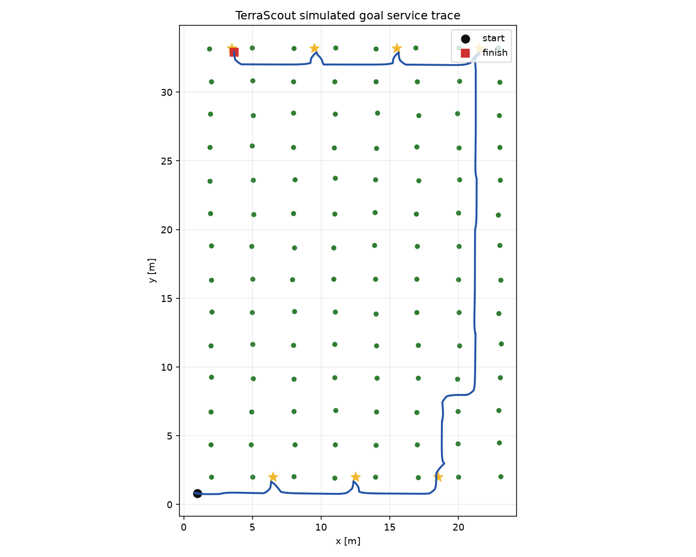
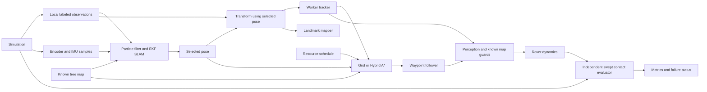

# TerraScout

[](https://github.com/KazmirFahrier/terrascout/actions/workflows/ci.yml)


A reproducible orchard autonomy simulation by **Kazmir Fahrier**. TerraScout connects localization, worker tracking, path planning, scheduling, and rover control, with independent evaluation of executed motion.

The default mission navigates using a particle filter. It services selected goal locations in a known synthetic orchard. This is a robotics software portfolio project: no physical rover, field accuracy, crop sensing, electrical hardware, or production safety certification has been validated.



## Run it

Python 3.11 and 3.12 are tested in CI. The constraints file pins the tested dependency set.

```bash
python -m venv .venv
source .venv/bin/activate
python -m pip install -e ".[dev]" -c constraints-ci.txt
terrascout-demo --trace artifacts/mission_trace.json
terrascout-reproduce --skip-gif
```

The reproduction writes traces, CSV measurements, a PNG, and `artifacts/reproduce_summary.json`. The summary records Python and library versions, the Git revision, whether the checkout was modified, and a hash of the Python source. CI retains its own results as downloadable workflow artifacts for 14 days.

```bash
terrascout-demo --planner hybrid --pose-source particle
terrascout-demo --pose-source slam
terrascout-demo --pose-source truth
terrascout-demo --rows 30 --max-goals 10 --battery-budget-m 700 --daylight-budget-s 900
terrascout-demo --scenario scenarios/default_orchard.json
python -m pytest
python -m pytest -m performance --no-cov
```

`truth` is an explicit diagnostic baseline. The geometric Hybrid A* option can fall back to grid A*. It does not guarantee final heading or bounded curvature throughout the returned path.

## Implemented behavior

* A differential drive simulator applies wheel saturation and slip, with circular rover and obstacle footprints.
* A particle filter and EKF SLAM consume local observations and motion estimates from simulated encoders and IMU yaw rate. The selected estimator drives navigation and supplies the reported navigation error.
* The tracker and landmark mapper receive the same local observation frame transformed through the selected navigation pose.
* Grid A* rejects blocked routes and diagonal corner cutting. Both planners validate intermediate segments, endpoint connections, obstacle inflation, and orchard boundaries.
* The follower turns before translating and checks its lookahead against the known map. The command supervisor slows or stops for perceived workers and rejects missing or stale observation metadata.
* Workers move independently of the rover. Their random motion stream is separate from sensor sampling. An optional cooperative worker model remains available for separate experiments but is not used by missions.
* An evaluator checks swept rover motion against trees, moving workers, and boundaries. Contact terminates the mission and is reported by obstacle type.
* The scheduler predicts feasible goal subsets. Execution separately enforces distance, daylight, and modeled energy limits. Service requires two simulated seconds at a goal.

## Recorded results

The following snapshot comes from [the archived reference summary](docs/validation/reference_summary.json). It is a local simulation measurement, not a field result. Fresh CI results can differ and are retained separately. Run `python docs/update_readme_kpis.py --summary docs/validation/reference_summary.json --check` to check that this table matches the archive.

<!-- TERRASCOUT_KPI_START -->
Recorded simulation results. See the protocol and limitations below.

| Experiment | Measured result |
| --- | --- |
| Default mission (particle) | 100% requested goals serviced; 0 contacts |
| Default suite, 5 seeds | 74% mean requested goal completion; 1 contacts |
| 30 row priority trials | 19/20 runs completed all goals; 3/10 minimum completed goals; 1 contacts across 20 runs |
| Moving mission localization | 0.064 m mean selected pose error |
| Static relocalization, 10 poses | 0.023 m p95 final position error |
| Constant velocity tracking, 100 scenes | 0.037 m mean matched prediction error; 100% ID continuity |
| Standalone EKF SLAM traversal | 0.076 m mean final pose error; 0.209 m mean map error |
| Planner geometry comparison | 0.0% Hybrid A* heading change reduction; budget met solve time (mean <=250 ms) |
| Resource schedule versus exact oracle | 0.000% maximum objective gap |
<!-- TERRASCOUT_KPI_END -->

## What each measurement means

| Measurement | Protocol and limit |
| --- | --- |
| Mission completion | Completed goal services divided by all requested candidate goals, including those the scheduler drops. Zero requested or feasible goals never produces 100% success. |
| `inspected_rows`, `total_rows` | Compatibility field names for serviced and requested goal counts. Reaching an endpoint does not establish row coverage or crop inspection. `scheduled_goals` reports the selected subset. |
| Contacts | Continuous segment checks within each simulator tick, using a 0.45 m rover radius, 0.18 m tree radius, and each worker's body radius. `collisions` counts contact entries; `collision_frames` counts ticks with contact. |
| Worker clearance | Minimum actual swept separation between body surfaces. A negative value means overlap; no workers produces JSON `null`. It is evaluated independently of sensor visibility. |
| Navigation error | Mean position error of the selected pose source against simulator truth. Particle and SLAM errors are also reported separately. Benchmark summaries average the per run means. Truth mode correctly reports zero selected pose error. |
| Resources | `battery_remaining_m` and `daylight_remaining_s` derive from executed motion and elapsed time. Fields prefixed `forecast_` are scheduler predictions based on straight line travel. There is no guaranteed return to a charger. |
| Static localization | Ten stationary poses, a perturbed prior, exact landmark map, scan matching, and five fresh observation frames. The final position p95 is not a moving mission accuracy guarantee. |
| Tracking | One hundred constant velocity scenes with ten workers. ID continuity penalizes missing established identities. Detection recall and matched prediction sample count accompany conditional prediction error. There is no occlusion or missed detection stress in this module benchmark. |
| SLAM | A standalone 300 second traversal with ideal command odometry, known initial pose, 20 Hz control, and observations every 0.75 seconds. Mapping results are separate from mission navigation. |
| Planning | Both planners use the same sum of geometric segment heading changes. This is not executed steering effort. Negative reduction means Hybrid A* performed worse. Failed paths have zero waypoints and must not be interpreted as fast successful plans. |
| Scheduling | Comparison to an exact oracle for the same simplified straight line cost model. The exact search is capped at 12 candidate goals in missions; use `max_goals` for larger orchards. |
| Timing | Wall time is machine dependent. The functional coverage run is separate from a 15 second local mission runtime guard. No real hardware control deadline has been measured. |

The default benchmark uses seeds `2, 3, 5, 7, 11`. The larger experiment uses twenty seeds, thirty tree rows, ten requested priority goals, one independent worker, particle navigation, and explicit budgets. The stress suite also records truth and SLAM variants, including clear worker scenarios. The CSVs retain incomplete runs and collisions.

## Sensor and map boundaries

The mission consumes synthetic labeled range and bearing centroids with noise, range limits, and a 270 degree field of view. These observations have ideal object labels and do not model occlusion. The full ray scan generator and RANSAC trunk detector are separately tested modules; they are not wired into the mission perception chain. Worker detection from raw lidar remains future work.

Particle localization and planning use the generated, known tree map. The mission does not plan from the reconstructed SLAM map. Estimators start from a supplied initial pose or nearby prior. IMU and encoder samples are synthetic and have no physical calibration evidence. Synchronous simulation frames are marked fresh; hardware timestamp transport and driver watchdog integration remain unimplemented.

A stopped rover can still be struck by an independent worker. This simulator records such failures; command slowing is not a certified human safety system. Charging is available as a standalone battery model operation; mission runs no longer recharge merely by passing a station.

## Architecture


```mermaid
flowchart LR
  world[Simulation] --> local[Local labeled observations]
  world --> odom[Encoder and IMU samples]
  local --> estimates[Particle filter and EKF SLAM]
  odom --> estimates
  estimates --> nav[Selected pose]
  local --> transform[Transform using selected pose]
  nav --> transform
  transform --> tracker[Worker tracker]
  transform --> mapper[Landmark mapper]
  known[Known tree map] --> estimates
  known --> planner[Grid or Hybrid A*]
  tracker --> planner
  nav --> planner
  scheduler[Resource schedule] --> planner
  planner --> follower[Waypoint follower]
  follower --> safety[Perception and known map guards]
  tracker --> safety
  safety --> rover[Rover dynamics]
  rover --> evaluator[Independent swept contact evaluator]
  world --> evaluator
  evaluator --> metrics[Metrics and failure status]
```

## Validation and documentation

[Repair notes and remaining limits](docs/VALIDATION.md) explain the audit fixes. [Design notes](docs/design/README.md) cover the component equations. The [project summary](docs/PROJECT_ONE_PAGER.md) also has a [PDF version](docs/PROJECT_ONE_PAGER.pdf).

CI checks lint, strict typing, functional coverage, elapsed mission time, a wheel installed outside the checkout, and the reproduction workflow. It retains results even when a check fails. The scripts in `benchmarks/` run individual experiments. `docs/render_milestone_demos.py` can regenerate component illustrations; archived component GIFs are illustrations, not current mission acceptance evidence.
